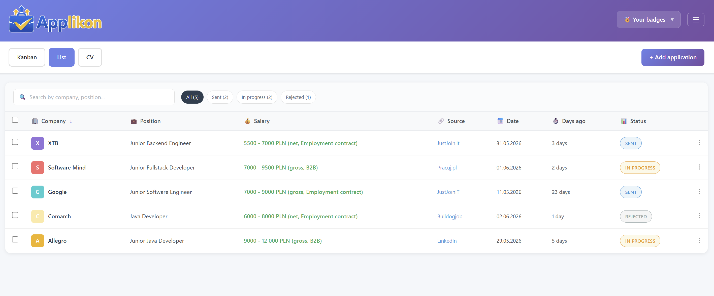

# 💼 EasyApply


[](https://github.com/jakubBone/EasyApply/actions/workflows/ci.yml)


EasyApply is a job application tracker for IT candidates in Poland. One place for applications, CVs, and interview notes, instead of scattered spreadsheets and expired links. Designed for anyone actively applying to multiple positions at once.

<div align="center">

[](https://aplikujbezspiny.pl)
<br>

[-FF0000?style=for-the-badge&logo=youtube&logoColor=white)](https://www.youtube.com/watch?v=sqIwGYWYn_E)
[](https://aplikujbezspiny.pl)
<br>
</div>

## 🧠 Spec-Driven Development with AI

Built with **Claude Code** using a strict spec-first approach: every phase starts with a written specification, gets reviewed, then moves to implementation. No code was written without a plan first.

 →  →  →  → 

```
spec/
├── v1/                         
│   ├── 01-vision/              ← MVP scope
│   ├── 02-implementation/      ← implementation plan
│   ├── 03-review/              ← code review
│   ├── 04-mvp-refactoring/     ← refactoring & learning (Claude as mentor)
│   ├── 05-additional-features/ ← i18n, onboarding, gamification
│   ├── 06-cleanup/             ← technical cleanup
│   ├── 07-privacy-rodo/        ← RODO & privacy policy
│   ├── 08-user-data/           ← account management
│   ├── 09-security-refactoring/ ← OWASP audit, timing attack fix, HMAC-SHA256 tokens
│   ├── 10-logging/             ← production observability
│   ├── 11-swagger/             ← API documentation
│   ├── 12-ci/                  ← GitHub Actions CI
│   ├── 13-docker-registry/     ← Docker & GHCR
│   ├── architecture.md         ← package structure, REST endpoints, DB schema, FE components
│   └── as-built.md             ← plan vs reality, deviations, phase history
└── v2/                         
    └── vision.md               ← microservices + AI features (CV analysis, job matching)
```


## ✨ Features

- **Application registry** - company, position, salary (range, currency, gross/net, contract type), job source, link to posting
- **Kanban board** - visual overview of recruitment status: Sent → In progress → Completed, with drag & drop
- **Recruitment stages** - tracking current stage: HR interview, technical interview, manager interview, recruitment task, final interview, or custom stage
- **CV archive** - storing different CV versions (link or note — file upload temporarily disabled) and assigning them to specific applications
- **Notes** - saving interview questions, feedback, and personal thoughts for each application (categories: Questions / Feedback / Other)
- **Job posting archive** - copy of the job description in case the link expires
- **Duplicate detection** - warning when reapplying to the same company and position
- **Badge system** - achievements for rejections and ghosting (gamification)
- **Authentication** - Google OAuth2 login, JWT access token + refresh token
- **i18n** - Polish and English interface with a language switcher
- **Settings** - account management: change display name, delete account
- **Data export** - download all personal data as JSON (RODO Art. 20)
- **Service notices** - system announcements displayed on login (maintenance, updates)
- **API documentation** - Swagger UI with all endpoints, request/response schemas, and authorization


## 🐳 Running with Docker

```bash
cp .env.example .env        # fill in Postgres credentials + Google OAuth client ID/secret
docker compose up --build
```

Open `http://localhost:3000`. All required variables are documented in `.env.example`.

Production images (published to GHCR on every `master` build):
```
ghcr.io/jakubbone/easyapply-backend:latest
ghcr.io/jakubbone/easyapply-frontend:latest
```


## 🔒 Privacy & Data

- **Refresh tokens** stored as HMAC-SHA256 hashes - a stolen database cannot be used to hijack sessions
- **Logs** contain UUIDs only - no emails, names, or tokens in plaintext
- **Account deletion** permanently removes all data; inactive accounts purged after 12 months

Full design rationale: [`spec/v1/07-privacy-rodo/`](spec/v1/07-privacy-rodo/)

